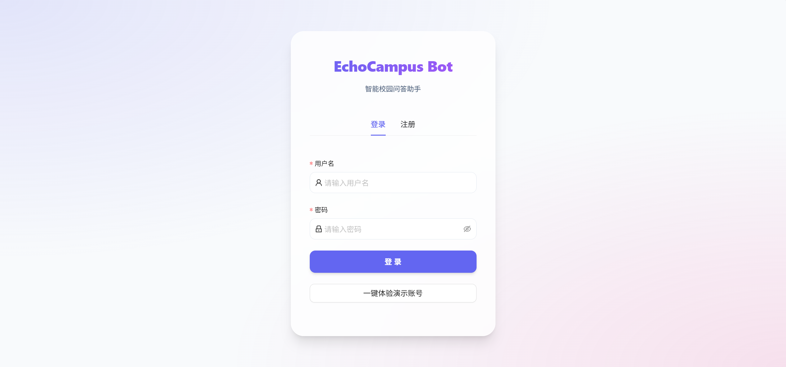
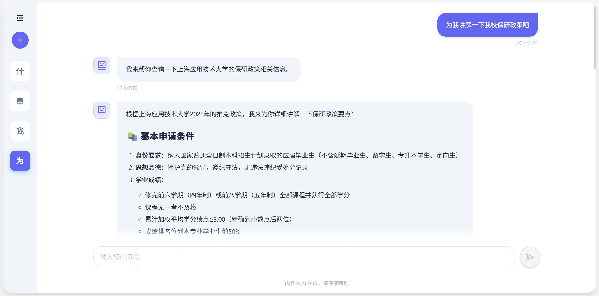
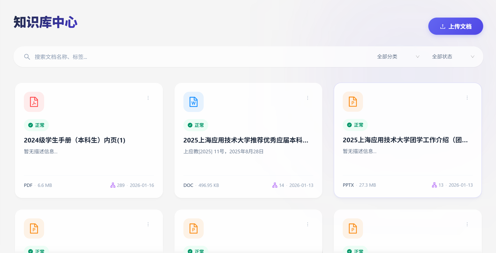

<p align="center">
  
</p>

<h1 align="center">EchoCampus-Bot</h1>

<p align="center">
  <strong>An Intelligent Campus Knowledge Q&A Robot Based on RAG Technology</strong>
</p>

<p align="center">
  <a href="README.md">简体中文</a> | English | <a href="README.ja.md">日本語</a>
</p>

<p align="center">
  <!-- Badges -->
  <a href="LICENSE"></a>
  
  
  
  
</p>

<p align="center">
  <a href="#-features">Features</a> •
  <a href="#-quick-start">Quick Start</a> •
  <a href="#-demo">Demo</a> •
  <a href="#-architecture">Architecture</a> •
  <a href="#-documentation">Documentation</a> •
  <a href="#-contributing">Contributing</a>
</p>

---

## 📖 Introduction

**EchoCampus-Bot** is an intelligent campus knowledge Q&A robot based on **RAG (Retrieval-Augmented Generation)** technology. It adopts a modern front-end and back-end separation architecture, combining Spring Boot, Vue.js, PostgreSQL, and Milvus vector database to provide accurate and intelligent knowledge Q&A services for campus users.

### Key Highlights

| Feature | Description |
|---------|-------------|
| 🧠 **RAG-based Q&A** | Retrieval-augmented generation for precise, evidence-based answers |
| 📚 **Multi-format Support** | Support for PDF, Word, PPT, Markdown, TXT, and more |
| 🔍 **Semantic Search** | Efficient semantic similarity search using Milvus vector database |
| ⚡ **Smart Chunking** | LangChain4j recursive splitting to maintain semantic integrity |
| 🔐 **Complete Security** | JWT authentication, email verification, operation logs |
| 🐳 **Containerized Deployment** | One-click deployment with Docker Compose |

### How It Works

```
User Question → Vectorization → Milvus Retrieval → Context Building → DeepSeek Generation → Return Answer
```

---

## ✨ Features

### 💬 Intelligent Q&A System

- **RAG Architecture** - Retrieval-augmented generation for evidence-based accurate answers
- **Multi-turn Conversations** - Context-aware dialogue for coherent interactions
- **Source Citation** - Answers with knowledge sources for verification
- **Markdown Rendering** - Support for code highlighting, tables, and rich text

### 📚 Knowledge Base Management

- **Multi-format Parsing** - Support for PDF, DOCX, DOC, PPT, PPTX, MD, TXT formats
- **Smart Chunking** - LangChain4j recursive splitting for semantic integrity
- **Category Management** - Flexible knowledge classification for easy organization
- **Batch Operations** - Support for bulk upload, delete, and other operations

### 🔐 User & Security

- **User Authentication** - Secure JWT Token authentication
- **Email Verification** - Email verification code for registration/password recovery
- **Role-based Access** - User/Admin role distinction
- **Operation Logs** - Complete audit trail for all operations

### ⚙️ System Management

- **Configuration Center** - Visual parameter configuration without restart
- **Data Analytics** - Q&A statistics, user statistics, and data analysis
- **System Monitoring** - API response time and call frequency monitoring
- **Rate Limiting** - Built-in request rate limiting to prevent abuse

### Supported Document Formats

| Format | Extension | Parser | Description |
|--------|-----------|--------|-------------|
| PDF | `.pdf` | Apache PDFBox 3.0 | Text-based PDF support |
| Word | `.docx`, `.doc` | Apache POI 5.2 | Office document support |
| PPT | `.pptx`, `.ppt` | Apache POI 5.2 | Extract slide text |
| Markdown | `.md` | Flexmark | Preserve structure |
| Plain Text | `.txt` | Java Native | Universal text format |

---

## 🚀 Quick Start

### Environment Requirements

| Environment | Version | Description |
|-------------|---------|-------------|
| JDK | 17+ | Backend runtime |
| Node.js | 18+ | Frontend build environment |
| Docker | 20.10+ | Containerized deployment (recommended) |
| PostgreSQL | 15+ | Relational database |
| Milvus | 2.3+ | Vector database |

### Docker One-Click Deployment (Recommended)

```bash
# 1. Clone the project
git clone https://github.com/1na-ko/EchoCampus-Bot.git
cd EchoCampus-Bot

# 2. Configure environment variables
cp .env.example .env
# Edit .env file and fill in API keys

# 3. Start all services
docker-compose -f docker-compose.dev.yml up -d

# 4. Check service status
docker-compose ps
```

### Manual Installation

<details>
<summary>Click to expand manual installation steps</summary>

#### 1️⃣ Start Basic Services

```bash
# Start PostgreSQL
docker run -d --name echocampus-postgres \
  -e POSTGRES_DB=echocampus_bot \
  -e POSTGRES_USER=echocampus \
  -e POSTGRES_PASSWORD=your_password \
  -p 5432:5432 postgres:15

# Start Milvus (refer to official documentation)
# https://milvus.io/docs/install_standalone-docker.md
```

#### 2️⃣ Backend Service

```bash
cd backend

# Configure database connection (edit application-dev.yml)
# Build and run
./mvnw clean package -DskipTests
java -jar target/echocampus-bot-1.0.0.jar --spring.profiles.active=dev
```

#### 3️⃣ Frontend Service

```bash
cd frontend

# Install dependencies
pnpm install

# Development mode
pnpm dev

# Production build
pnpm build
```

</details>

### Required API Keys

The following API services need to be configured:

| Service | Purpose | How to Get |
|---------|---------|------------|
| Alibaba Cloud Bailian | Text vectorization (Qwen3-Embedding) | [Bailian Console](https://bailian.console.aliyun.com/) |
| DeepSeek | Large Language Model | [DeepSeek Platform](https://platform.deepseek.com/) |

Configure in `.env` file:

```bash
# AI Service Configuration
ALIYUN_API_KEY=your_aliyun_api_key
DEEPSEEK_API_KEY=your_deepseek_api_key
```

### Basic Usage

1. **Access System**: Open browser and visit `http://localhost:5173` (dev mode) or `http://localhost` (Docker deployment)
2. **Register Account**: Fill in username and email to complete registration
3. **Upload Knowledge**: Go to knowledge base management and upload documents
4. **Start Chatting**: Ask questions in the chat interface to get intelligent answers

---

## 📸 Demo

<p align="center">
  
  <br><em>Login Screen</em>
</p>

<p align="center">
  
  <br><em>Chat Screen</em>
</p>

<p align="center">
  
  <br><em>Knowledge Screen</em>
</p>

---

## 🏗️ Architecture

### System Architecture

```
┌─────────────────────────────────────────────────────────────────────┐
│                       User Interface (Vue.js 3)                        │
│     Chat  │  Knowledge Mgmt  │  User Center  │  Settings           │
└──────────────────────────────┬───────────────────────────────────────┘
                               │ RESTful API
┌──────────────────────────────┴───────────────────────────────────────┐
│                    Backend Services (Spring Boot 3)                    │
│  ┌──────────┐  ┌──────────┐  ┌──────────┐  ┌──────────┐            │
│  │ Q&A Svc  │  │Knowledge │  │User Svc │  │System   │            │
│  └────┬─────┘  └────┬─────┘  └────┬─────┘  └────┬─────┘            │
└───────└─────────────└─────────────└─────────────└───────────────────┘
        │             │             │             │
┌───────┴─────────────┴─────────────┴─────────────┴───────────────────┐
│                           Data Storage Layer                           │
│  ┌─────────────────┐              ┌─────────────────┐               │
│  │   PostgreSQL    │              │     Milvus      │               │
│  │  • User data     │              │  • Doc vectors   │               │
│  │  • Chat history  │              │  • Semantic idx  │               │
│  │  • Knowledge meta│              │                 │               │
│  └─────────────────┘              └─────────────────┘               │
└─────────────────────────────────────────────────────────────────────┘
                               │
┌──────────────────────────────┴───────────────────────────────────────┐
│                          AI Service Layer                             │
│  ┌─────────────────────┐      ┌─────────────────────┐              │
│  │  Alibaba Cloud       │      │     DeepSeek        │              │
│  │  Qwen3-Embedding     │      │   deepseek-chat   │              │
│  │  Vectorization(1024d)│      │   Answer Gen      │              │
│  └─────────────────────┘      └─────────────────────┘              │
└─────────────────────────────────────────────────────────────────────┘
```

### Tech Stack

<table>
  <tr>
    <th align="center">🖥️ Frontend</th>
    <th align="center">⚙️ Backend</th>
    <th align="center">💾 Data Storage</th>
    <th align="center">🤖 AI Services</th>
  </tr>
  <tr>
    <td>
      <br>
      <br>
      <br>
      <br>
      
    </td>
    <td>
      <br>
      <br>
      <br>
      <br>
      
    </td>
    <td>
      <br>
      <br>
      
    </td>
    <td>
      <br>
      
    </td>
  </tr>
</table>

---

## 📂 Project Structure

```
EchoCampus-Bot/
├── 📁 backend/                    # Backend Spring Boot project
│   ├── src/main/java/            # Java source code
│   │   └── com/echocampus/bot/
│   │       ├── config/           # Configuration (Security, AI, Milvus, etc.)
│   │       ├── controller/       # RESTful controllers
│   │       ├── service/          # Business logic layer
│   │       ├── mapper/           # MyBatis data access
│   │       ├── entity/           # Entity classes
│   │       ├── dto/              # Data transfer objects
│   │       ├── parser/           # Document parsers
│   │       └── utils/            # Utility classes
│   ├── src/main/resources/       # Configuration files
│   └── pom.xml                   # Maven configuration
│
├── 📁 frontend/                   # Frontend Vue.js project
│   ├── src/
│   │   ├── api/                  # API interface wrappers
│   │   ├── components/           # Shared components
│   │   ├── views/                # Page views
│   │   ├── stores/               # Pinia state management
│   │   ├── router/               # Router configuration
│   │   └── utils/                # Utility functions
│   ├── package.json              # Dependency configuration
│   └── vite.config.ts            # Vite build configuration
│
├── 📁 docs/                       # Project documentation
│   ├── 项目结构设计书.md          # Complete technical architecture (Chinese)
│   ├── deployment/               # Deployment documentation
│   ├── development/              # Development documentation
│   └── reference/                # Reference materials
│
├── 🐳 docker-compose.dev.yml     # Development Docker config
├── 🐳 docker-compose.prod.yml    # Production Docker config
├── 📄 .env.example               # Environment variables template
└── 📄 README.md                  # Project documentation (this file)
```

> 📖 **Detailed Documentation**: See [Project Architecture Design](docs/项目结构设计书.md) (Chinese)

---

## 📚 Documentation

| Document | Description |
|----------|-------------|
| 📐 [Project Architecture Design](docs/项目结构设计书.md) | Complete system architecture, database design, API specs (Chinese) |
| 🚀 [Quick Deployment Guide](docs/deployment/快速部署指南.md) | Local development and production deployment (Chinese) |
| ⚙️ [Environment Variables](docs/deployment/环境变量配置说明.md) | Environment variable configuration guide (Chinese) |
| 🧪 [Testing Guide](docs/development/测试代码说明.md) | Testing architecture and guide (Chinese) |
| 🔍 [RAG Implementation](docs/reference/知识库检索增强功能说明.md) | RAG technology implementation (Chinese) |

### API Documentation

After starting the backend service, access Swagger documentation:
- Development: `http://localhost:8083/doc.html`
- Production: `http://your-domain/api/doc.html`

---

## 🤝 Contributing

We welcome all forms of contributions! Whether it's reporting issues, suggesting features, or submitting code.

### How to Contribute

1. **Fork** this repository
2. **Create** a feature branch (`git checkout -b feature/AmazingFeature`)
3. **Commit** your changes (`git commit -m 'Add some AmazingFeature'`)
4. **Push** to the branch (`git push origin feature/AmazingFeature`)
5. **Submit** a Pull Request

### Code Standards

- Backend follows [Alibaba Java Coding Guidelines](https://github.com/alibaba/p3c)
- Frontend follows [Vue.js Style Guide](https://vuejs.org/style-guide/)
- Commit messages follow [Conventional Commits](https://www.conventionalcommits.org/)

### Submit Issues

- 🐛 **Bug Reports**: Use bug report template with detailed reproduction steps
- 💡 **Feature Requests**: Describe expected functionality and use cases
- 📖 **Documentation**: Point out errors or unclear parts in documentation

---

## 📋 Roadmap

- [x] 🧠 RAG intelligent Q&A core functionality
- [x] 📚 Multi-format document parsing and vectorization
- [x] 🔐 User authentication and authorization
- [x] 🐳 Docker containerized deployment
- [x] 📧 Email verification
- [x] 🔄 Streaming response (SSE)
- [ ] 🌎 Multi-language support
- [ ] 📱 Mobile responsive design
- [ ] 🔌 Plugin system
- [ ] 📊 Advanced analytics dashboard

> 💬 Have feature suggestions? Welcome to [submit an issue](../../issues/new)!

---

## 💬 Community Support

If you encounter problems during use, you can get help through:

- 📖 Read [Project Documentation](docs/README.md)
- 🔍 Search [Existing Issues](../../issues)
- ❓ Submit [New Issue](../../issues/new)
- 💬 Join [Discussions](../../discussions)

---

## 📄 License

This project is licensed under [GNU General Public License v3.0](LICENSE).

GPL-3.0 is a strong copyleft license that requires derivative works to be released under the same license.

---

## 🙏 Acknowledgments

Thanks to the following open source projects and services:

- [Spring Boot](https://spring.io/projects/spring-boot) - Backend framework
- [Vue.js](https://vuejs.org/) - Frontend framework
- [LangChain4j](https://docs.langchain4j.dev/) - LLM application framework
- [Milvus](https://milvus.io/) - Vector database
- [Apache PDFBox](https://pdfbox.apache.org/) - PDF parsing
- [Apache POI](https://poi.apache.org/) - Office document parsing
- [Alibaba Cloud Bailian](https://bailian.console.aliyun.com/) - Embedding service
- [DeepSeek](https://www.deepseek.com/) - LLM service

---

<p align="center">
  If this project helps you, please give us a ⭐ Star!
</p>

<p align="center">
  Made with ❤️ by EchoCampus Team from Shanghai Institute of Technology
</p>

