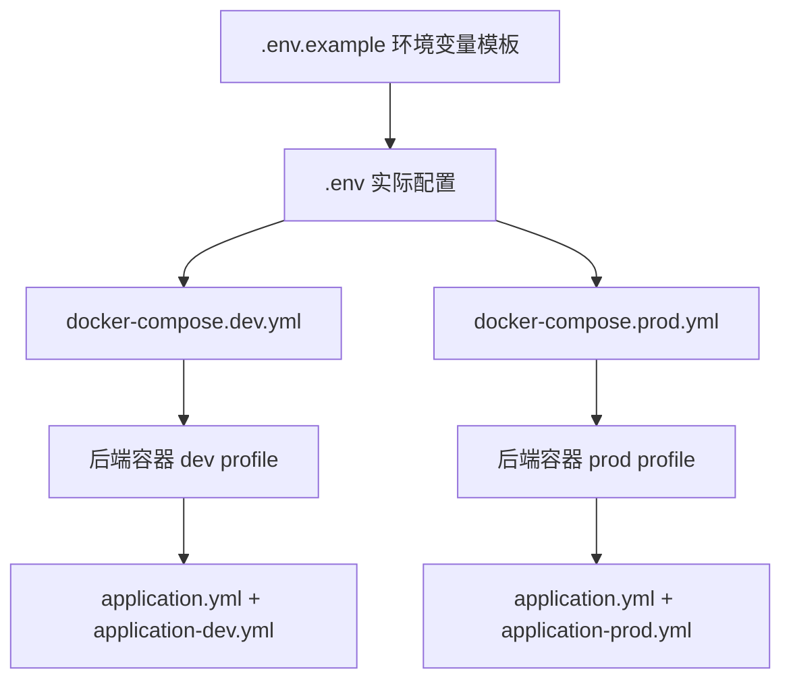
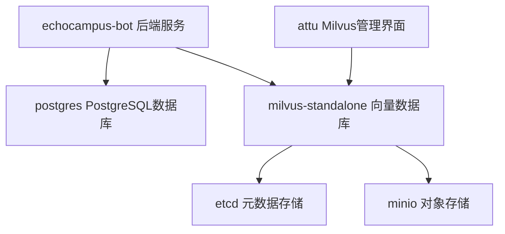

# 配置审计报告

> **文档状态**: 📦 已归档 (2026年1月14日)  
> **执行时间**: 2026年1月13日

## 审计目标
对EchoCampus-Bot项目进行系统性的配置审计和优化，建立符合开源标准的配置体系。

---

## 一、配置清理清单

### ✅ 已删除的冗余配置

| 文件路径 | 删除原因 | 替代方案 |
|---------|---------|---------|
| `docker-compose.yml` | 硬编码本地环境配置，包含敏感信息 | `docker-compose.dev.yml` |
| `docker-compose-server.yml` | 硬编码生产环境配置，包含真实API密钥和密码 | `docker-compose.prod.yml` |
| `backend/src/main/resources/application-docker.yml` | 环境配置冗余，功能已被环境专用配置覆盖 | `application-dev.yml` 和 `application-prod.yml` |

### ✅ 已修复的安全问题

| 文件路径 | 安全问题 | 修复措施 |
|---------|---------|---------|
| `.env` | 包含真实API密钥（sk-f5245...和sk-db96e...） | 替换为占位符值 |
| `frontend/.env.production` | 包含真实服务器IP（150.158.97.39） | 替换为占位符 |
| `docker-compose-server.yml` | 硬编码API密钥、密码、镜像仓库地址 | 文件已删除，使用环境变量方式 |

### ✅ 已更新的配置文件

| 文件路径 | 更新内容 |
|---------|---------|
| `application.yml` | 移除环境特定配置，保留通用配置；修改默认profile从`local`到`dev` |
| `.env.example` | 增强环境变量模板，添加详细注释和获取指引 |
| `.gitignore` | 更新忽略规则，确保敏感文件被正确忽略 |

---

## 二、新配置体系结构

### 📁 配置文件层次结构

```
EchoCampus-Bot/
├── .env.example                          # 环境变量模板（版本控制）
├── .env                                  # 实际环境变量（gitignore）
├── docker-compose.dev.yml                # 本地开发环境配置
├── docker-compose.prod.yml               # 生产环境配置
├── backend/src/main/resources/
│   ├── application.yml                   # 通用基础配置
│   ├── application-dev.yml               # 开发环境专用配置
│   └── application-prod.yml              # 生产环境专用配置
└── frontend/
    ├── .env.development                  # 前端开发环境配置
    └── .env.production                   # 前端生产环境配置（需手动配置）
```

### 🔄 配置加载流程

#### 本地开发环境
```
1. 加载 .env 文件
2. Docker Compose 读取 docker-compose.dev.yml
3. 后端启动时设置 SPRING_PROFILES_ACTIVE=dev
4. Spring Boot 加载配置顺序：
   application.yml (基础配置)
   └── application-dev.yml (覆盖/扩展)
```

#### 生产环境
```
1. 加载 .env 文件（需手动配置真实值）
2. Docker Compose 读取 docker-compose.prod.yml
3. 后端启动时设置 SPRING_PROFILES_ACTIVE=prod
4. Spring Boot 加载配置顺序：
   application.yml (基础配置)
   └── application-prod.yml (覆盖/扩展)
```

---

## 三、配置依赖关系图

### 环境变量依赖关系



### Docker服务依赖关系



---

## 四、环境变量说明文档

### 必需配置项

| 变量名 | 说明 | 默认值 | 环境 | 获取方式 |
|--------|------|--------|------|----------|
| `POSTGRES_DB` | 数据库名称 | echocampus_bot | 通用 | 自定义 |
| `POSTGRES_USER` | 数据库用户名 | postgres | 通用 | 自定义 |
| `POSTGRES_PASSWORD` | 数据库密码 | - | **必填** | 自定义（生产环境必须使用强密码） |
| `ALIYUN_API_KEY` | 阿里云Embedding服务密钥 | - | **必填** | https://dashscope.console.aliyun.com/apiKey |
| `DEEPSEEK_API_KEY` | DeepSeek LLM服务密钥 | - | **必填** | https://platform.deepseek.com/api_keys |
| `JWT_SECRET` | JWT签名密钥 | - | **必填** | 强随机字符串（至少64字符） |

### 可选配置项

| 变量名 | 说明 | 默认值 | 环境 |
|--------|------|--------|------|
| `POSTGRES_PORT` | PostgreSQL端口 | 5432 | 通用 |
| `BACKEND_PORT` | 后端服务宿主机端口 | 8083 | 通用 |
| `MAIL_USERNAME` | 邮件服务用户名 | - | 通用 |
| `MAIL_PASSWORD` | 邮件服务密码/授权码 | - | 通用 |
| `CORS_ALLOWED_ORIGINS` | CORS允许的源 | - | 生产 |
| `DOCKER_IMAGE` | Docker镜像地址 | echocampus-bot:latest | 生产 |
| `MINIO_ACCESS_KEY` | MinIO访问密钥 | minioadmin | 通用 |
| `MINIO_SECRET_KEY` | MinIO密钥 | minioadmin | 通用 |

### 密钥生成建议

```bash
# 生成强JWT密钥
openssl rand -base64 64

# 生成强数据库密码
openssl rand -base64 32
```

---

## 五、部署验证检查清单

### ✅ 本地开发环境部署检查

- [ ] `.env`文件已创建并填入API密钥
- [ ] 执行`mvn clean package -DskipTests`构建成功
- [ ] 执行`docker-compose -f docker-compose.dev.yml up -d --build`启动成功
- [ ] 所有服务健康检查通过：`docker-compose -f docker-compose.dev.yml ps`
- [ ] 后端健康检查API可访问：`curl http://localhost:8083/api/v1/health`
- [ ] API文档可访问：http://localhost:8083/api/doc.html
- [ ] Milvus管理界面可访问：http://localhost:8000

### ✅ 生产环境部署检查

- [ ] `.env`文件已配置生产环境真实值
- [ ] `POSTGRES_PASSWORD`使用强密码
- [ ] `JWT_SECRET`使用强随机字符串
- [ ] `CORS_ALLOWED_ORIGINS`配置为实际前端域名
- [ ] Docker镜像已构建并推送到镜像仓库
- [ ] `DOCKER_IMAGE`变量指向正确的镜像地址
- [ ] 执行`docker-compose -f docker-compose.prod.yml up -d`启动成功
- [ ] 所有服务健康检查通过
- [ ] 日志中无敏感信息泄露
- [ ] API密钥配置正确，服务正常响应

---

## 六、安全合规检查

### ✅ 已实施的安全措施

1. **敏感信息隔离**
   - ✅ 所有敏感信息通过环境变量注入
   - ✅ `.env`文件已添加到`.gitignore`
   - ✅ 提供`.env.example`模板，不包含真实密钥

2. **配置文件安全**
   - ✅ 移除所有硬编码的API密钥
   - ✅ 移除所有硬编码的密码
   - ✅ 移除所有真实服务器IP地址

3. **权限控制**
   - ✅ Docker容器使用非root用户运行（spring用户）
   - ✅ 生产环境禁用Druid监控页面
   - ✅ 生产环境日志级别设置为INFO

4. **版本控制安全**
   - ✅ `.gitignore`正确配置，防止敏感文件提交
   - ✅ 旧配置文件已删除，防止历史泄露

### ⚠️ 需要用户注意的安全事项

1. **定期轮换密钥**
   - 建议每3-6个月轮换API密钥
   - 建议每月轮换JWT_SECRET（需重新登录所有用户）

2. **生产环境配置**
   - 必须修改默认数据库密码
   - 必须配置CORS白名单
   - 建议使用HTTPS部署

3. **前端部署流程更新**
   - 部署前需清空服务器上原有的前端内容。
   - 确保清空后上传新内容，以触发服务器的缓存刷新机制。
   - 检查上传完成后，访问前端页面以验证缓存刷新是否生效。

4. **备份策略**
   - 定期备份PostgreSQL数据库
   - 定期备份Milvus向量数据
   - 保存环境变量配置的安全副本

---

## 七、配置最佳实践符合性

### ✅ 符合的最佳实践

1. **12-Factor App原则**
   - ✅ 配置与代码分离
   - ✅ 使用环境变量管理配置
   - ✅ 明确区分开发和生产环境

2. **Docker最佳实践**
   - ✅ 使用docker-compose管理多容器应用
   - ✅ 使用健康检查确保服务可用
   - ✅ 使用数据卷持久化数据
   - ✅ 使用桥接网络隔离服务

3. **Spring Boot最佳实践**
   - ✅ 使用Profile管理多环境配置
   - ✅ 敏感配置使用环境变量注入
   - ✅ 配置层次清晰（通用→环境特定）

4. **开源项目标准**
   - ✅ 提供完整的配置示例
   - ✅ 不包含任何敏感信息
   - ✅ 文档完善，易于理解

---

## 八、遗留问题与建议

### 需要手动处理的事项

1. **Git历史清理**
   - 旧配置文件中的敏感信息仍在Git历史中
   - 建议：如需开源，使用`git filter-branch`或`BFG Repo-Cleaner`清理历史

2. **文档更新**
   - 部分文档（如`后端部署流程.md`）仍引用旧配置文件名
   - 建议：统一更新所有文档引用

3. **前端环境配置**
   - 前端`.env.production`需手动配置实际服务器地址
   - 建议：添加前端环境变量配置说明

### 未来优化建议

1. **密钥管理**
   - 考虑使用密钥管理服务（如HashiCorp Vault、AWS Secrets Manager）
   - 实施自动密钥轮换机制

2. **配置验证**
   - 添加环境变量验证脚本
   - 启动前检查必需配置项是否存在

3. **多环境支持**
   - 考虑添加测试环境配置（docker-compose.test.yml）
   - 添加CI/CD环境配置

---

## 九、总结

### 配置优化成果

1. **安全性提升**
   - 移除所有硬编码敏感信息
   - 建立环境变量注入机制
   - 正确配置版本控制忽略规则

2. **可维护性提升**
   - 配置层次清晰，易于理解
   - 环境隔离明确，减少配置错误
   - 删除冗余配置，简化维护

3. **开源就绪性**
   - 符合开源项目标准
   - 提供完整配置模板
   - 无敏感信息泄露风险

### 最终配置清单

**保留配置（共8个文件）**：
- ✅ `.env.example` - 环境变量模板
- ✅ `.env` - 本地环境变量（gitignore）
- ✅ `docker-compose.dev.yml` - 本地开发环境
- ✅ `docker-compose.prod.yml` - 生产环境
- ✅ `application.yml` - 通用基础配置
- ✅ `application-dev.yml` - 开发环境配置
- ✅ `application-prod.yml` - 生产环境配置
- ✅ `frontend/.env.development` - 前端开发配置
- ✅ `frontend/.env.production` - 前端生产配置（模板）

**删除配置（共3个文件）**：
- ❌ `docker-compose.yml`
- ❌ `docker-compose-server.yml`
- ❌ `application-docker.yml`

---

## 十、后续行动建议

### 立即执行

1. ✅ 验证本地开发环境部署
2. ✅ 验证生产环境部署流程
3. ⚠️ 更新项目文档中的配置引用

### 近期执行

1. 清理Git历史中的敏感信息
2. 添加配置验证脚本
3. 完善部署文档和README

### 长期规划

1. 引入密钥管理服务
2. 实施自动化CI/CD
3. 添加配置审计定期检查

---

**审计完成日期**：2026年1月13日  
**审计结论**：配置体系已完成全面优化，符合开源项目标准，安全性和可维护性显著提升。
