# IT知识问答机器人 - 项目快速入门指南

## 📋 项目概述

本项目是一个基于**RAG(Retrieval-Augmented Generation)**技术的智能IT知识问答机器人,采用前后端分离架构,结合Spring Boot、Vue.js、PostgreSQL、Milvus等现代化技术栈实现。

### 核心功能
- 💬 智能问答: 基于RAG技术提供准确的IT知识问答
- 📚 知识库管理: 支持文档上传、分类、检索和向量化
- 💾 对话历史: 支持多轮对话,保存对话记录
- ⚙️ 系统配置: 灵活的系统参数配置
- 📊 数据统计: 问答统计和系统监控

### 技术栈

#### 后端
- **框架**: Spring Boot 3.x
- **ORM**: MyBatis-Plus
- **数据库**: PostgreSQL 15 + Milvus 2.x
- **AI接口**: 阿里云Embedding API + DeepSeek V3
- **构建工具**: Maven
- **部署**: Docker + Docker Compose

#### 前端
- **框架**: Vue.js 3.3 + TypeScript
- **UI组件**: Element Plus
- **状态管理**: Pinia
- **路由**: Vue Router 4
- **HTTP**: Axios
- **构建工具**: Vite

## 🚀 快速开始

### 1. 环境准备

#### 必需软件
- Java 17+
- Maven 3.8+
- Node.js 16+
- PostgreSQL 15+
- Docker & Docker Compose
- Git

#### 开发工具推荐
- IntelliJ IDEA (后端)
- VS Code (前端)
- DBeaver (数据库)
- Postman (API测试)

### 2. 克隆项目

```bash
git clone https://github.com/yourusername/it-qabot.git
cd it-qabot
```

### 3. 后端项目配置

#### 3.1 数据库初始化

执行数据库脚本:
```bash
psql -U postgres -d it_qabot -f docs/database/init.sql
```

或者使用数据库工具导入 `数据库设计.sql` 文件。

#### 3.2 配置application.yml

```yaml
# src/main/resources/application.yml
server:
  port: 8080

spring:
  datasource:
    url: jdbc:postgresql://localhost:5432/it_qabot
    username: qabot
    password: your_password
    driver-class-name: org.postgresql.Driver

# MyBatis-Plus配置
mybatis-plus:
  configuration:
    log-impl: org.apache.ibatis.logging.stdout.StdOutImpl
  mapper-locations: classpath*:mapper/*.xml

# AI服务配置
ai:
  aliyun:
    access-key: your_aliyun_access_key
    secret-key: your_aliyun_secret_key
    embedding-endpoint: your_embedding_endpoint
  deepseek:
    api-key: your_deepseek_api_key
    model: deepseek-chat

# Milvus配置
milvus:
  host: localhost
  port: 19530
  collection-name: it_knowledge
```

#### 3.3 运行后端项目

```bash
# 安装依赖
mvn clean install

# 运行项目
mvn spring-boot:run

# 或者打包后运行
mvn clean package
java -jar target/it-qabot-1.0.0.jar
```

### 4. 前端项目配置

#### 4.1 安装依赖

```bash
cd it-qabot-frontend
npm install
# 或使用yarn
yarn install
```

#### 4.2 配置环境变量

创建 `.env.development` 文件:
```env
VITE_API_BASE_URL=http://localhost:8080/api/v1
VITE_APP_NAME=IT知识问答机器人
```

#### 4.3 运行前端项目

```bash
# 开发模式
npm run dev

# 构建生产版本
npm run build

# 预览构建结果
npm run preview
```

### 5. Docker部署(推荐)

#### 5.1 使用Docker Compose一键部署

```bash
# 启动所有服务
docker-compose up -d

# 查看服务状态
docker-compose ps

# 查看日志
docker-compose logs -f backend

# 停止服务
docker-compose down
```

#### 5.2 服务访问

- **前端应用**: http://localhost
- **后端API**: http://localhost:8080
- **API文档**: http://localhost:8080/api/doc.html
- **PostgreSQL**: localhost:5432
- **Milvus**: localhost:19530

## 📁 项目结构

### 后端项目结构
```
it-qabot/
├── src/main/java/com/example/itqabot/
│   ├── ItQabotApplication.java          # 启动类
│   ├── config/                          # 配置类
│   │   ├── MyBatisConfig.java
│   │   ├── MilvusConfig.java
│   │   └── AiServiceConfig.java
│   ├── controller/                      # 控制器
│   │   ├── ChatController.java
│   │   ├── KnowledgeController.java
│   │   └── UserController.java
│   ├── service/                         # 服务层
│   │   ├── ChatService.java
│   │   ├── KnowledgeService.java
│   │   └── AiService.java
│   ├── mapper/                          # MyBatis Mapper
│   ├── entity/                          # 实体类
│   ├── dto/                             # 数据传输对象
│   └── utils/                           # 工具类
├── src/main/resources/
│   ├── application.yml
│   └── mapper/                          # MyBatis XML映射
├── Dockerfile
├── docker-compose.yml
└── pom.xml
```

### 前端项目结构
```
it-qabot-frontend/
├── src/
│   ├── components/                      # 公共组件
│   │   ├── ChatMessage.vue
│   │   ├── FileUpload.vue
│   │   └── MarkdownViewer.vue
│   ├── views/                           # 页面组件
│   │   ├── Chat.vue
│   │   ├── Knowledge.vue
│   │   └── Settings.vue
│   ├── api/                             # API接口
│   ├── stores/                          # Pinia状态管理
│   ├── utils/                           # 工具函数
│   ├── types/                           # TypeScript类型
│   └── router/                          # 路由配置
├── public/
├── package.json
├── vite.config.ts
└── tsconfig.json
```

## 🔧 核心功能实现

### 1. RAG问答流程

```mermaid
graph TD
    A[用户提问] --> B[问题预处理]
    B --> C[文本向量化]
    C --> D[Milvus向量检索]
    D --> E[构建Prompt]
    E --> F[DeepSeek生成答案]
    F --> G[后处理优化]
    G --> H[返回用户]
    H --> I[保存对话历史]
```



### 2. 知识库管理流程

```mermaid
graph TD
    A[上传文档] --> B[文件解析]
    B --> C[文本分块]
    C --> D[向量化处理]
    D --> E[存储Milvus]
    E --> F[保存元数据]
    F --> G[索引完成]
```



### 3. 关键代码示例

#### 3.1 RAG问答服务

```java
@Service
public class ChatService {
    
    @Autowired
    private AiService aiService;
    
    @Autowired
    private MilvusService milvusService;
    
    @Autowired
    private MessageMapper messageMapper;
    
    public ChatResponse sendMessage(ChatRequest request) {
        // 1. 向量化用户问题
        float[] questionVector = aiService.getTextEmbedding(request.getMessage());
        
        // 2. Milvus检索相关文档
        List<SearchResult> searchResults = milvusService.search(
            questionVector, 
            5,  // Top-K
            0.7f // 相似度阈值
        );
        
        // 3. 构建Prompt
        String context = buildContext(searchResults);
        String prompt = buildPrompt(context, request.getMessage());
        
        // 4. 调用DeepSeek生成答案
        String answer = aiService.generateAnswer(prompt);
        
        // 5. 保存消息记录
        saveMessage(request.getConversationId(), "USER", request.getMessage());
        saveMessage(request.getConversationId(), "BOT", answer);
        
        // 6. 返回结果
        return ChatResponse.builder()
            .answer(answer)
            .sources(searchResults)
            .build();
    }
    
    private String buildContext(List<SearchResult> results) {
        StringBuilder context = new StringBuilder();
        for (SearchResult result : results) {
            context.append(result.getContent()).append("\n\n");
        }
        return context.toString();
    }
    
    private String buildPrompt(String context, String question) {
        return String.format(
            "你是一名专业的IT知识问答助手。请基于以下提供的参考资料,准确、简洁地回答用户的问题。\n\n" +
            "参考资料:\n%s\n\n" +
            "用户问题: %s\n\n" +
            "回答要求:\n" +
            "1. 只使用参考资料中的信息\n" +
            "2. 如果问题与参考资料无关,请说明\"抱歉,我暂时无法回答这个问题\"\n" +
            "3. 语言简洁清晰,避免冗长\n" +
            "4. 可以适当使用列表、代码块等格式\n\n" +
            "回答:",
            context, question
        );
    }
}
```

#### 3.2 知识库文档处理

```java
@Service
public class KnowledgeService {
    
    @Autowired
    private AiService aiService;
    
    @Autowired
    private MilvusService milvusService;
    
    @Autowired
    private KnowledgeDocMapper docMapper;
    
    @Autowired
    private KnowledgeChunkMapper chunkMapper;
    
    @Async
    public void processDocument(Long docId) {
        try {
            // 1. 获取文档
            KnowledgeDoc doc = docMapper.selectById(docId);
            
            // 2. 解析文档内容
            String content = parseDocument(doc.getFilePath());
            
            // 3. 文本分块
            List<TextChunk> chunks = textSplitter.split(content);
            
            // 4. 批量向量化
            List<float[]> vectors = aiService.getTextEmbeddings(
                chunks.stream().map(TextChunk::getContent).collect(Collectors.toList())
            );
            
            // 5. 存储到Milvus
            List<String> vectorIds = milvusService.insertVectors(vectors);
            
            // 6. 保存分块信息到数据库
            for (int i = 0; i < chunks.size(); i++) {
                KnowledgeChunk chunk = new KnowledgeChunk();
                chunk.setDocId(docId);
                chunk.setContent(chunks.get(i).getContent());
                chunk.setVectorId(vectorIds.get(i));
                chunkMapper.insert(chunk);
            }
            
            // 7. 更新文档状态
            doc.setStatus(DocStatus.COMPLETED);
            doc.setVectorCount(chunks.size());
            docMapper.updateById(doc);
            
        } catch (Exception e) {
            log.error("Failed to process document: {}", docId, e);
            // 更新失败状态
            KnowledgeDoc doc = new KnowledgeDoc();
            doc.setId(docId);
            doc.setStatus(DocStatus.FAILED);
            doc.setProcessMessage(e.getMessage());
            docMapper.updateById(doc);
        }
    }
}
```

## 🧪 测试方案

### 1. 单元测试

```java
@SpringBootTest
public class ChatServiceTest {
    
    @Autowired
    private ChatService chatService;
    
    @Test
    @DisplayName("测试RAG问答")
    public void testRagQa() {
        // Given
        ChatRequest request = new ChatRequest();
        request.setMessage("什么是Spring Boot?");
        
        // When
        ChatResponse response = chatService.sendMessage(request);
        
        // Then
        assertNotNull(response);
        assertNotNull(response.getAnswer());
        assertTrue(response.getAnswer().contains("Spring"));
        assertTrue(response.getSources().size() > 0);
    }
}
```

### 2. API测试

使用Postman或Apifox测试API接口:

```http
### 发送消息
POST http://localhost:8080/api/v1/chat/message
Content-Type: application/json
Authorization: Bearer your_token

{
  "message": "什么是Java?"
}

### 获取对话列表
GET http://localhost:8080/api/v1/chat/conversations
Authorization: Bearer your_token
```

### 3. 前端测试

```typescript
// 组件测试示例
import { mount } from '@vue/test-utils'
import ChatMessage from '@/components/ChatMessage.vue'

describe('ChatMessage.vue', () => {
  it('renders user message correctly', () => {
    const wrapper = mount(ChatMessage, {
      props: {
        senderType: 'USER',
        content: 'Hello, AI!',
        createdAt: '2024-01-01T00:00:00Z'
      }
    })
    
    expect(wrapper.text()).toContain('Hello, AI!')
    expect(wrapper.classes()).toContain('USER')
  })
})
```

## 📊 性能优化

### 1. 数据库优化
- 为常用查询字段添加索引
- 使用连接池优化数据库连接
- 定期清理历史数据

### 2. 缓存策略
- Redis缓存热点知识库内容
- 本地缓存用户会话信息
- CDN加速静态资源

### 3. AI调用优化
- 批量向量化处理
- 异步处理文档索引
- 请求重试机制

### 4. 前端优化
- 懒加载组件
- 虚拟滚动优化长列表
- 图片和资源压缩

## 🔍 监控与日志

### 1. 日志配置

```yaml
logging:
  level:
    com.example.itqabot: INFO
    io.milvus: WARN
  file:
    name: logs/it-qabot.log
    max-size: 100MB
    max-history: 30
```

### 2. 监控指标
- API响应时间
- AI调用次数和耗时
- 数据库查询性能
- 系统资源使用率

### 3. 健康检查

```java
@RestController
public class HealthController {
    
    @GetMapping("/health")
    public Map<String, Object> health() {
        Map<String, Object> health = new HashMap<>();
        health.put("status", "UP");
        health.put("timestamp", LocalDateTime.now());
        health.put("version", "1.0.0");
        return health;
    }
}
```

## 🐛 常见问题

### 1. 数据库连接失败
- 检查PostgreSQL是否启动
- 验证数据库连接配置
- 检查防火墙设置

### 2. Milvus连接失败
- 确认Milvus服务状态
- 检查端口是否开放
- 验证集合是否存在

### 3. AI接口调用失败
- 检查API密钥配置
- 验证网络连接
- 查看API配额和限制

### 4. 前端构建失败
- 检查Node.js版本
- 清理node_modules重新安装
- 检查环境变量配置

## 📚 学习资源

### 官方文档
- [Spring Boot官方文档](https://spring.io/projects/spring-boot)
- [Vue.js 3官方文档](https://vuejs.org/)
- [Element Plus组件库](https://element-plus.org/)
- [Milvus向量数据库](https://milvus.io/)

### 技术博客
- [RAG技术详解](https://www.pinecone.io/learn/retrieval-augmented-generation/)
- [Spring Boot最佳实践](https://www.baeldung.com/spring-boot)
- [Vue 3组合式API](https://vuejs.org/guide/extras/composition-api-faq.html)

### 视频教程
- Spring Boot入门到精通
- Vue 3 + TypeScript实战
- 向量数据库Milvus使用指南

## 🤝 贡献指南

### 开发流程
1. Fork项目到个人仓库
2. 创建功能分支 (`git checkout -b feature/AmazingFeature`)
3. 提交更改 (`git commit -m 'Add some AmazingFeature'`)
4. 推送到分支 (`git push origin feature/AmazingFeature`)
5. 创建Pull Request

### 代码规范
- 遵循Java和TypeScript编码规范
- 编写单元测试
- 更新相关文档
- 通过Code Review

## 📞 技术支持

### 联系方式
- 📧 Email: support@example.com
- 💬 微信群: IT知识问答机器人技术群
- 🐛 Issue反馈: https://github.com/yourusername/it-qabot/issues

### 更新日志
查看 [CHANGELOG.md](CHANGELOG.md) 了解版本更新内容。

---

**祝您开发愉快!** 🎉
